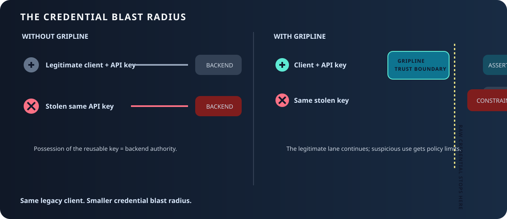

<p align="center">
  <strong>Gripline</strong>
</p>

<p align="center">
  <strong>Credential containment and authorization gateway for inference APIs.</strong>
</p>

<p align="center">
  <a href="#quick-start">Quick start</a> ·
  <a href="docs/design/00-overview.md">Design</a> ·
  <a href="AUDIT.md">Audit</a> ·
  <a href="SECURITY.md">Security</a>
</p>

<p align="center">
  <a href="https://github.com/B-A-M-N/gripline/actions/workflows/ci.yaml"></a>
  
  
  
</p>

<p align="center"><strong>Credentials stop at the line · Authority continues across it · Legacy clients keep working</strong></p>

<p align="center"></p>

## Why I built this

I built Gripline after studying API credential theft and unauthorized access to
hosted AI systems. Reusable API keys are convenient, but possession of a key
should not grant unlimited authority behind the provider edge. Gripline is my
response: terminate the reusable credential at the provider boundary,
reconstruct narrowly scoped internal authority, and contain suspicious use
without requiring legacy clients to change.

Gripline does not stop a credential from being stolen; it reduces what
possession of that credential can authorize after theft.

Gripline is a provider-agnostic gateway that terminates reusable external
credentials at the provider trust boundary, reconstructs authority from scoped
internal identity and current security state, constrains suspicious contexts
via security lanes, and enforces hard resource limits — transparently to
legacy clients.

## What Gripline is—and is not

| Gripline is | Gripline is not |
|---|---|
| A terminate-and-forward credential containment gateway | A credential vault or password manager |
| Deterministic, policy-driven admission enforcement | An LLM classifier or heuristic black box |
| A signed internal-identity boundary in front of a private backend | A public proxy for reaching arbitrary hosts |
| Auditable: every operator mutation commits with its audit record | A substitute for operator judgment and incident response |
| Single-node durable (transactional bbolt state authority) | A multi-node coordination layer (Raft/etcd is out of beta scope) |

## How it works

```text
Client (legacy API compatible)
   │  presents reusable external credential
   ▼
Gripline data plane
   ├── terminate: extract + strip the external secret before provider adapters
   ├── classify: lane features + trusted source identity (sanitized view only)
   ├── evaluate: evidence → deterministic risk → policy precedence
   ├── constrain: hard concurrency/request limits; token/cost when metering is wired
   └── re-inject: short-lived signed internal assertion (≤30s, audience-bound)
   ▼
Private inference backend
   │  verifies the assertion — it never saw the external credential
   ▼
Streamed response (SSE passes through chunk-by-chunk; bounded metering when configured)
```

The external credential stops at Gripline. Downstream systems authenticate a
short-lived signed assertion bound to a principal, a lane, and the current
policy revision — so a stolen upstream secret is not a stolen backend
identity, and misuse is constrained before it becomes exhaustion.

The backend is part of the trust boundary: deploy it on a private network
segment or enforce an equivalent mTLS/network-policy gate, configure it to
accept only Gripline assertions, and prove that direct raw-credential access
returns `403`. The compiled release harness exercises the verifier and direct
access proof locally; it cannot prove a production network perimeter.

## Quick start

Build and run against a private backend:

```bash
go build -o gripline ./cmd/gripline

cp deploy/config.example.json config.json
export GRIPLINE_PEPPER_V1="$(openssl rand -base64 32)"   # verifier pepper (>=32 bytes entropy)
export GRIPLINE_OPERATOR_TOKEN="$(openssl rand -base64 32)" # admin bearer token (>=32 bytes)
export GRIPLINE_PSEUDONYM_KEY="$(openssl rand -base64 32)"  # trusted-ingress key (>=32 bytes)

# Before starting, edit config.json for your backend and point its TLS and
# persistent state/keyring paths at files/directories this deployment owns.
mkdir -p tls state
openssl req -x509 -newkey rsa:2048 -nodes -days 1 -subj '/CN=localhost' \
  -keyout tls/key.pem -out tls/cert.pem >/dev/null 2>&1
printf '%s' "$GRIPLINE_OPERATOR_TOKEN" > operator-token
chmod 600 operator-token
./gripline -config config.json &
curl --fail --silent --insecure https://127.0.0.1:8443/readyz

# After readiness: publish backend verification keys, provision a credential,
# configure the backend with verification-keys.json, then send inference traffic.
./gripline keys export --config config.json > verification-keys.json
openssl rand -base64 32 > provider-key
chmod 600 provider-key
./gripline credential add --config config.json --id <cred> --account <acct> --reason "provision" --secret-stdin --token-file operator-token < provider-key
```

`deploy/config.example.json` is a complete, validated production-shaped
configuration. Boot fails closed on missing decisions: no TLS posture, no
fixed backend, unbounded timeouts, missing persistent state — any of these is
a startup error, not a degraded runtime.

Operator lifecycle:

```bash
gripline status     --config /etc/gripline/config.json   # what is durable / on / off, honestly
gripline credential list   --config c.json --token-file /run/secrets/gripline-operator
gripline credential add   --config c.json --id <cred> --account <acct> --reason "provision" --secret-stdin --token-file /run/secrets/gripline-operator < /run/secrets/provider-key
gripline credential revoke --config c.json --id <cred> --reason "..." --token "$GRIPLINE_OPERATOR_TOKEN"
gripline lane list         --config c.json --credential <cred> --token-file /run/secrets/gripline-operator
gripline lane unblock      --config c.json --credential <cred> --id <lane> --reason "..." --token-file /run/secrets/gripline-operator
gripline audit list        --config c.json --token-file /run/secrets/gripline-operator
gripline audit export      --config c.json --token-file /run/secrets/gripline-operator > audit.jsonl
gripline audit security list   --config c.json --token-file /run/secrets/gripline-operator
gripline audit security export --config c.json --token-file /run/secrets/gripline-operator > security.jsonl
gripline keys export       --config c.json   # public backend verification material only
gripline policy verify     --config c.json   # verify the configured signed policy artifact
gripline version

# Live signer rotation is intentionally not exposed in public beta. Coordinate
# key lifecycle externally, then publish the public verification material:
gripline keys export --config c.json > verification-keys.json
```

Lifecycle and audit commands use the running private admin listener by default;
`--offline` is an explicit stopped-database maintenance mode for credential and
lane commands. Generate operator tokens with `openssl rand -base64 32` (or a
stronger secret source); tokens shorter than 32 bytes are rejected at startup.
The plaintext admin listener binds to loopback only. For remote operations,
use an SSH local-forward or place a mutually authenticated TLS control-plane
wrapper in front of it; do not expose the bearer-token listener to a LAN.

Container:

```bash
docker build -t gripline -f deploy/Dockerfile .

# For a bind-mounted volume, pre-create it for the image's non-root UID.
install -d -o 65532 -g 65532 ./gripline-state
chmod 0644 ./config.json       # the distroless UID 65532 must be able to read it
docker run --user 65532:65532 \
  -v "$PWD/config.json:/etc/gripline/config.json:ro" \
  -v "$PWD/gripline-state:/var/lib/gripline" gripline
```

The state database and signer keyring must be on a persistent volume; the
gateway refuses to boot in ephemeral mode unless a deployment explicitly opts
in (`deployment.allow_ephemeral_state`).

The configured `server.spool_dir` must be writable. In a read-only-root
container, use a bounded tmpfs mount such as
`--tmpfs /tmp/gripline-spool:rw,noexec,nosuid,size=64m`; Gripline removes stale
`gripline-body-*.tmp` files there at startup.

The stock executable supports versioned verifier peppers through
`secrets.pepper_versions` (the example maps version `1` to
`GRIPLINE_PEPPER_V1`). Keep the old version and add the new version during a
migration; existing records continue to authenticate, while `credential add`
derives new verifiers with the highest configured version. Re-provision records
before retiring an old pepper. Pepper material belongs in the deployment's
secret injector, not in the state database.

## Guarantees (and how they are proven)

- **The raw external secret is not forwarded past the boundary** — stripped
  immediately from the inbound header map before source/usage adapters run;
  only a signed assertion is re-injected on the trusted hop (INV-1/10/11/12).
  As with any Go process, caller-owned immutable input bytes may still exist in
  runtime memory; Gripline zeroes every mutable copy it owns.
- **Containment survives restart** — credential CONSTRAINED/REVOKED, lane
  SUSPICIOUS/BLOCKED, evidence, emergency posture, and signer identity restore
  from the transactional bbolt state plus the restricted signer keyring
  (`TestAcceptanceRestartContainment`).
- **Operator mutations are atomic with their audit** — revoke, unblock, and
  posture changes commit mutation + audit row in one transaction
  (`control.MutationStore`).
- **True streaming** — SSE passes through chunk-by-chunk (a buffering proxy
  fails the timing acceptance), long-lived streams are never killed by a
  blanket write timeout, and a stalled upstream is cut by an idle bound.
- **Fail-closed deployment posture** — private-only admin bind (no override),
  private bind required for cleartext upstream termination, base64 ≥32-byte
  pepper/pseudonym keys that must differ, real `/readyz` probing the state
  authority.

Verification: `go vet`, `staticcheck`, `gofmt`, and `go test -race ./...` are
repository gates; the compiled release harness starts the gateway and a
separate public-verifier backend and proves a real request/response path. The
networked executable acceptance suite still requires a host network namespace.
The current in-process benchmark is a development signal, not a production
latency SLO; deployers must measure p95/p99 on their hardware.

Tagged releases publish SHA-256 checksums with a keyless Sigstore bundle and
sign the pushed container manifest with the same OIDC-backed release identity;
GitHub build-provenance attestations are published for both artifact classes.

## Definitive causal demo

Run the browser demo locally:

```bash
go run ./cmd/gripline-demo
```

Open the printed URL and run `RUN FULL DEMO`. The two panels use the same exact
credential: the baseline accepts the stolen-key client, while Gripline's real
HTTP path uses the demo's configured source adapter to observe a
residential-to-hosting source change, mints live evidence, blocks only the
attacking lane, and continues serving the legitimate lane.
The timeline is emitted by the admission observer and includes request IDs,
source pseudonyms, evidence, risks, transitions, decisions, and assertion
verification. CI/release checks can run the non-interactive proof with:

```bash
go run ./cmd/gripline-demo --headless
```

The demo is intentionally local and single-node; it is not a substitute for a
provider SDK matrix, a distributed resource harness, or production telemetry.

## Design

Engineering design documents live in [`docs/design/`](docs/design/), derived
from the Gripline specification (v0.1.0):

- [`00-overview.md`](docs/design/00-overview.md) — what it is, scope, modes, language choice, module boundary.
- [`01-containment.md`](docs/design/01-containment.md) — credential terminator, secret lifecycle, invariants.
- [`02-lanes.md`](docs/design/02-lanes.md) — security lanes, features, classification, states.
- [`03-evidence-risk.md`](docs/design/03-evidence-risk.md) — evidence model, families, deterministic risk.
- [`04-policy-resource.md`](docs/design/04-policy-resource.md) — policy, precedence, hard limits, leases.
- [`05-internal-identity.md`](docs/design/05-internal-identity.md) — internal identity + assertions.
- [`06-observability.md`](docs/design/06-observability.md) — telemetry, pseudonymization, retention, audit.
- [`07-deployment.md`](docs/design/07-deployment.md) — modes, failure semantics, multi-node, FI integration.
- [`08-testing.md`](docs/design/08-testing.md) — test strategy + acceptance gates.

### Provider backend integration

Protected Go services can import the public [`verify/`](verify/) package. It
loads the public JSON produced by `gripline keys export`, verifies the exact
audience and issuer, enforces the short TTL and revision claims, rejects
duplicate carriers/claims, and removes the assertion after successful
verification. It never receives signing keys or reusable credentials.

The wire format is intentionally explicit: `v1.base64url(payload).base64url(Ed25519
signature)`, with the claim set documented in
[`05-internal-identity.md`](docs/design/05-internal-identity.md). The public
verifier's conformance tests cover valid, expired, wrong-audience,
wrong-key-generation, stale-revision, tampered, duplicate, and malformed
assertions. Providers using another language should implement those vectors
before accepting production traffic.

## Status

**Phase: public beta.** The containment story is complete and acceptance-proven
on a single node. `AUDIT.md` is the durable verdict table for both external
reviews; the known-gaps list below is the binding honesty surface.

`✅` = implemented + tested · `◇` = partially / sketched

1. ✅ credential terminator — `internal/terminator`, `internal/secret`
2. ✅ credential-safe handling — `SealedSecret` forbids formatting/serialization
3. ✅ internal principal — `internal/principal`
4. ✅ internal signed identity — Ed25519, ≤30s TTL, audience-bound (`internal/terminator`)
5. ✅ private backend enforcement (terminate-and-forward proxy + backend verifier,
   optional revision-freshness + transport-identity checks at sensitive backends)
6. ✅ hard per-credential concurrency (atomic leases, INV-15; multi-scope governor)
7. ◇ hard resource velocity — typed multi-scope governor + token buckets with
   reserve-estimate/settle-actuals (`internal/resource`); enforcement is REAL for
   deployments that supply a provider `UsageProvider` (a streaming metering
   session that reads the final usage envelope at end-of-stream), but the
   shipped default (`NoUsage`) accounts requests only — token/cost dimensions
   stay inert until a provider adapter is wired
8. ✅ source key-spray detection — pseudonym fingerprints + invalid-credential
   spray signals (`internal/anomaly`, `internal/secret.SprayPseudonym`)
9. ✅ lane tracking — `internal/lane` (classification, trust/security axes,
   explosion protection, retention classes)
10. ✅ deterministic shadow evidence — `internal/evidence` + `internal/risk` (fuzzed 0..100)
11. ✅ audit trail — authenticated control plane with durable append-only operator
    audit (`internal/control`), atomic state+audit lane lifecycle (P0.49), and
    internal decision traces for denials (`internal/observability`, P0.50/P0.51)
12. ✅ adaptive-state failure semantics — DEGRADED never fails open (P0.1)
13. ✅ source-spray anomaly detector, bounded under one-shot-subject floods
    (`internal/anomaly`, P0.30–P0.32)
14. ◇ acceptance-gate COMPONENT tests (`internal/gates`, spec §111) — in-process
    component approximations of gates A–J, honestly named (`...Component`), plus
    a compiled single-node release harness covering the public verifier hop.
    These are NOT the full gates: multi-node resource proofs, network isolation,
    cross-process replay, and external telemetry canaries remain deployment
    evidence. Passing this package must never be reported as "gates A–J green".
15. ✅ shadow-first auto-quarantine — `Risk.EnableAutomaticQuarantine=false` default;
    request-level denial still fires, persisted quarantine stays operator-set
16. ✅ deployable executable — `cmd/gripline` + `internal/config`: boot-validated
    TLS posture, fixed backend, bounded timeouts/headers/bodies, graceful drain,
    readiness/liveness, optional authenticated admin listener

### Implemented packages

```
internal/secret        SealedSecret: opaque state pointer, active redaction of every fmt verb
                       (Format/String/GoString), no serializers, zeroize-on-Zero shared across
                       struct copies (INV-2; canary-tested incl. log/panic/error paths)
internal/credential    HMAC-SHA256 pepper verifier (keys copied on ingestion, empty keys refused),
                       CredentialRecord, status machine + hysteresis, registry with rotation-safe
                       verifier indexes + defensive re-check (INV-1,13)
internal/statebolt     the single transactional bbolt authority: credentials + verifier index,
                       lanes, evidence, operator audit, operator posture — one write path,
                       pure shared reducers (no semantic drift vs the memory backends)
internal/pseudonym     keyed HMAC source/fingerprint IDs (fail-closed construction, key copies,
                       negative versions refused), rotation (key distinct from verifier pepper)
internal/principal     Principal / AuthorizedContext (no secret field)
internal/lane          lane states NEW/PROBATION/ESTABLISHED/SUSPICIOUS/BLOCKED, full-vector
                       similarity classifier with schema revision, deterministic tie-breaking,
                       bounded store (insert-only rows, evict-before-limit, provisional cap), promotion
internal/evidence      bounded risk families, correlation groups, TTL≤0 = unbounded,
                       trusted Mint() from versioned rule table (unknown codes rejected)
internal/risk          deterministic 0..100 evaluation (family caps, correlation bounded per
                       subject+scope); fuzzed
internal/policy        versioned + validated policy (threshold ladder checked), enforcement
                       precedence (§58), TTL bound (INV-10)
internal/resource      atomic token buckets with all-or-nothing Reservations, concurrency leases
                       with shared release state (copy-safe, INV-15; race-tested)
internal/terminator    admission flow (§53): extract → strip secret+internal headers → authenticate →
                       policy binding → lane → evidence → risk → policy resolver → hard limit →
                       internal identity; policy snapshot at New; explicit TERMINATE/ENFORCE modes;
                       128-bit random request ids; Ed25519 keyring with
                       prepare/publish/accept/activate/retire rotation lifecycle
internal/proxy         terminate-and-forward data plane: strip reserved headers (INV-12), re-inject
                       signed assertion on the trusted hop, stream unchanged (INV-1/10/11);
                       bounded body spooling, streaming metering sessions, idle-bound stream cuts
internal/control       operator control plane: posture switch + authenticated RBAC service + durable
                       append-only operator audit (P0.47); transactional MutationStore (P0.18)
internal/anomaly       source-spray signal detector (ASN/credential/invalid-key spray), bounded state
                       + emit cooldown; signals resolve through Mint at the current policy revision
internal/observability DecisionRecord per admission (§97) projected from the internal DecisionTrace
                       (P0.50): denied decisions carry principal, lane, and policy revision (P0.51)
internal/gates         component invariant tests for the §111 gate properties (honestly named
                       `...Component`) — NOT the acceptance gates; compiled release/chaos harness shipped
```

### Known gaps (audit honesty)

These are known-unfinished parts of the system, stated here so no invariant is
claimed beyond what the implementation establishes:

- **Policy immutability:** the terminator enforces a compiled deep-copy
  snapshot and `policy.Manager` provides monotonic prepare/activate,
  last-known-good rollback, durable-manifest/artifact retention, and audit
  transitions. Configured policy files use the version-1 Ed25519 envelope;
  deployments may replace its verifier with a KMS/HSM integration.
- **One policy per process:** the shipped runtime selects one compiled policy
  snapshot for each process. `PlanID` is required credential metadata, but a
  multi-plan provider policy resolver is not shipped; deployments that need
  multiple plans must run separate policy-bound processes or add that resolver
  at the integration seam.
- **Single-node durable authority:** containment state is durable in one
  transactional bbolt database and restart-proven, but this is a SINGLE-NODE
  authority. Cross-replication (a BLOCKED lane blocked on every replica,
  shared resource leases across nodes, leader election) is out of beta scope.
- **Single-process resources:** the concurrency pool and token buckets prove
  the atomic accounting invariants in-process. Resource windows are explicitly
  process-lifetime and volatile; cross-node leases, reservation TTLs, orphan
  recovery, and durable budget continuity need a shared backend (see
  `07-deployment.md`).
- **Streaming equivalence is gate-tested, not SDK-proven:** the proxy streams
  generic HTTP + SSE pass-through with per-chunk flush and is acceptance-tested
  for byte fidelity, incremental chunk arrival, and stalled-stream cuts. The
  real third-party SDK matrix (OpenAI/Anthropic Python-TS, Claude Code, Codex)
  is not run in this repo; connector-level equivalence is verified in the
  hosting integration.
- **Provider adapters are explicit seams:** public `adapter/ingress` and
  `adapter/usage` contracts are shipped, with bounded OpenAI/Anthropic JSON
  metering and static CIDR metadata as reference adapters. A hosting
  integration must still wire authenticated edge source resolution and its
  authoritative provider usage semantics; `NoUsage` remains request-only.
- **Legacy Gob evidence:** `internal/evidence` remains for compatibility and
  explicitly ephemeral use. Production deployments must use `internal/statebolt`
  as the single transactional credential/lane/evidence/audit authority.
- **Acceptance gates are components, not gates:** `internal/gates` proves
  in-process approximations of the §111 properties under honest names. The
  compiled release harness proves the single-node gateway-to-public-verifier
  path; telemetry canary sweeps, network-isolation proofs, cross-process
  decision replay, and multi-node resource accounting remain deployment
  evidence. Do not certify release from this repo's tests alone.

## Invariants

The security invariants INV-1..INV-16 (§11 of the spec) are binding
requirements when TERMINATE mode is active. Each is enumerated as an
implementation requirement in [`01-containment.md`](docs/design/01-containment.md)
and checked by property tests in the `internal/` packages.

## Layout

```
cmd/gripline           deployable executable + operator CLI + acceptance suite
internal/secret        sealed secret container (the raw-secret boundary)
internal/credential    verifier + CredentialRecord + credential state machine
internal/statebolt     transactional bbolt state authority (single node)
internal/pseudonym     keyed HMAC pseudonymization
internal/principal     Principal / AuthorizedContext
internal/lane          security lanes
internal/evidence      evidence model
internal/risk          deterministic risk evaluation
internal/policy        versioned policy
internal/resource      token buckets / concurrency leases / velocity
internal/terminator    admission flow + internal identity issuance
internal/proxy         data plane: terminate, enforce, stream
internal/control       operator control plane + transactional mutations
deploy/                config.example.json + Dockerfile
```

Language: **Go** (stdlib-only security core). See
[`00-overview.md` §6](docs/design/00-overview.md) for rationale.

## Security claim

Gripline does **not** prevent credentials from being stolen. Its defensible
claim:

> Gripline terminates reusable external credentials at the provider trust
> boundary, reduces the systems in which those credentials can be exposed,
> reconstructs authorization from scoped internal identity and current security
> state, detects substantial evidence of credential misuse, and constrains
> suspicious contexts and resource consumption while preserving legacy API
> clients.

For hardened clients it can additionally use sender-constrained authentication.

## Security and responsible use

Gripline is containment and constraint, not a complete security program.
Operators remain responsible for credential issuance and revocation policy,
upstream provider terms, rate limiting and abuse response, data retention,
incident response, and the consequences of false positives (a constrained or
blocked lane denies real traffic until an operator acts). Read
[`SECURITY.md`](SECURITY.md) before deploying, and
[`AUDIT.md`](AUDIT.md) for the honest verdict table on both external
reviews. Follow the [vulnerability reporting
process](SECURITY.md#reporting-a-vulnerability) for security concerns — do
not open public issues for vulnerabilities.

## License

Source is available under [Apache License 2.0](LICENSE). You are responsible
for complying with the terms of any upstream inference provider whose traffic
you route through Gripline.

## Acknowledgements

Gripline was independently developed in part from thinking about abuse
resistance for public inference services, including FreeInference.org. It is
an independent, general-purpose project and is not affiliated with, sponsored
by, commissioned by, endorsed by, or developed under the direction of
FreeInference.org. FreeInference.org did not request or approve Gripline and
is not responsible for its design, implementation, documentation, or claims.

## Supporting Public Inference

Public inference gives more people room to learn, experiment, build, and
participate. If Gripline is useful to you, please consider supporting or
sponsoring [FreeInference.org](https://freeinference.org) through its official
support options; Gripline does not collect or redirect contributions on its
behalf.
